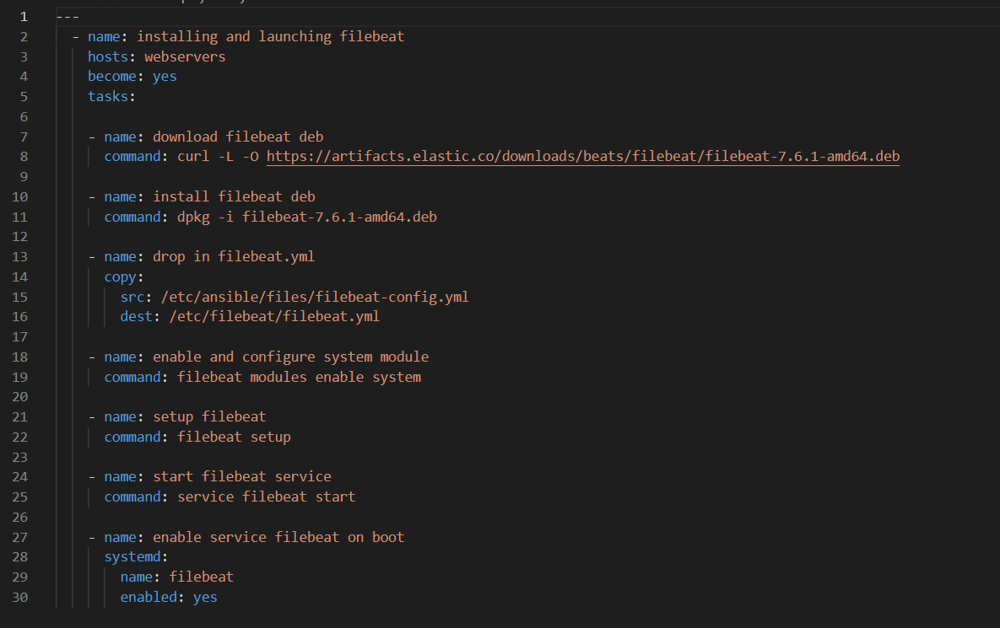

## Automated ELK Stack Deployment

The files in this repository were used to configure the network depicted below.

These files have been tested and used to generate a live ELK deployment on Azure. They can be used to either recreate the entire deployment pictured above. Alternatively, select portions of the roles directory ala playbook(.yml) file(s) may be used to install only certain pieces of it, such as Filebeat.

  - [Filebeat](Ansible/roles/filebeat-playbook.yml)

This document contains the following details:
- Description of the Topologu
- Access Policies
- ELK Configuration
  - Beats in Use
  - Machines Being Monitored
- How to Use the Ansible Build

### Description of the Topology

The main purpose of this network is to expose a load-balanced and monitored instance of DVWA, the D*mn Vulnerable Web Application.

Load balancing ensures that the application will be highly availability, in addition to restricting access to the network.

- They protect against DDOS attacks. Enabling the user access from a single secure node that can be monitored as well.

Integrating an ELK server allows users to easily monitor the vulnerable VMs for changes to the data and system logs.

- Filebeat is a lightweight shipper for forwarding and centralizing log data. Installed as an agent on your servers, Filebeat monitors the log files or locations that you specify, collects log events, and forwards them either to Elasticsearch or Logstash for indexing. 

- Metricbeat is a lightweight shipper that you can install on your servers to periodically collect metrics from the operating system and from services running on the server. Metricbeat takes the metrics and statistics that it collects and ships them to the output that you specify, such as Elasticsearch or Logstash. [Link to Metric beat](https://www.elastic.co/guide/en/beats/metricbeat/current/metricbeat-overview.html)

The configuration details of each machine may be found below.
| Name                 | Function                                        | IP Address | Operating System |
|----------------------|-------------------------------------------------|------------|------------------|
| Jump-Box-Provisioner | Admin Access for Internal access                | 10.0.0.5   | Linux            |
| Elk-Stack-VM         | Allows Access to Elk stack monitoring systems   | 10.1.0.4   | Linux            |
| Web-1                | Virtual Machine hosting DVMA Server             | 10.0.0.6   | Linux            |
| Web-2                | Virtual Machine hosting DVMA Server(Redundancy) | 10.0.0.7   | Linux            |

### Access Policies

The machines on the internal network are not exposed to the public Internet. 

Only the Jump-Box-Provisioner machine can accept connections from the Internet. Access to this machine is only allowed from the following IP addresses:
- Personal IP Address

Machines within the network can only be accessed by Jump-Box-Provisioner.
- This is the only machine able to SSH into the Elk VM for setup and monitoring purposes.

A summary of the access policies in place can be found in the table below.

| Name                 |  Publicly Accessible | Allowed IP Addresses |
|----------------------|----------------------|----------------------|
| Jump-Box-Provisioner | Yes/No (SSH)         | 10.0.0.5             |
| Elk-Stack-VM         | HTTP(SSH from Above) | 10.1.0.4             |
| Web-1                | Yes (HTTP)           | 10.0.0.6             |
| Web-2                | Yes (HTTP)           | 10.0.0.7             |

### Elk Configuration

Ansible was used to automate configuration of the ELK machine. No configuration was performed manually, which is advantageous because...
- It allows quick setup and maintance of multiple systems with simple playbook selections.

The playbook implements the following tasks:
- Installs Docker.io.
- Installs Python 3.
- Installs Docker module.
- Sets up Virtual Memory and tells the system to utilize it.
- Download and launch the docker elk container.

The following screenshot displays the result of running `docker ps` after successfully configuring the ELK instance.

[Elk-Docker-ps Image](Images/Elk-Docker-ps.png)

### Target Machines & Beats
This ELK server is configured to monitor the following machines:
- 10.0.0.6 (Web-1)
- 10.0.0.7 (Web-2)

We have installed the following Beats on these machines:
- Filebeat
- Metricbeat

These Beats allow us to collect the following information from each machine:
- Filebeat collects audit logs, depricatation logs, gc logs, server logs, slow logs.
- Metricbeat collects metrics and statistics from selected services (Apache, HAProxy, MongoDB, etc..).

### Using the Playbook
In order to use the playbook, you will need to have an Ansible control node already configured. Assuming you have such a control node provisioned: 

SSH into the control node and follow the steps below:
- Copy the " *-config.yml " file to "Elk-Stack-VM".
- Update the "hosts" file to include webservers 10.0.0.6 (Web-1), 10.0.0.7 (Web-2).
- Run the playbook, and navigate to Kibana to check that the installation worked as expected. [Link to Kibana](http://20.98.114.15:5601/app/kibana)

$ ansible-playbook *-playbook.yml

Example of Installing Filebeat inside the "Elk-Stack-VM"::
$ ansible-playbook filebeat-playbook.yml
